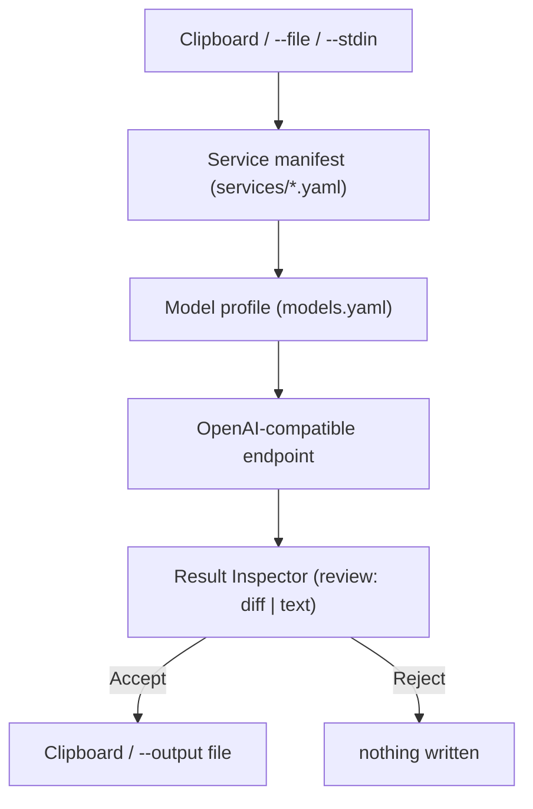

# Architecture

## The core idea

Services are declarative YAML, not code. One generic engine loads a
manifest, sends a request, and hands the result to a review UI — adding a
service means adding a file, never touching the engine.

## Module layout

| Module | Responsibility |
|---|---|
| `ai_actions/core.py` | Load `services/*.yaml`/`models.yaml`, build and send the chat-completion request, `validate_services()`. No GUI, no CLI concerns — this is what tests exercise directly. |
| `ai_actions/verify.py` | The one external-lookup step in the engine: resolves each line of a `verify: crossref` service's input against Crossref's public API before the model call. See [Service manifest](guide/service-manifest.md#verify-crossref). |
| `ai_actions/corpus.py` | The retrieval layer: BM25 lexical search over a directory of text files, for services declaring `corpus: <id>`. Fully local — no embeddings, no vector database. See [Corpora](guide/corpora.md). |
| `ai_actions/clipboard.py` | Clipboard read/write via `wl-clipboard`/`xclip` subprocesses. See [Roadmap](roadmap.md) for why this isn't `QClipboard`. |
| `ai_actions/manage.py` | The mutating half of service management — `create`/`set`/`duplicate`/`delete`, plus `open_editor()`. Edits YAML as targeted text, not a full parse/re-dump, to avoid mangling hand-formatted prompts. |
| `ai_actions/diff.py` | Word-level diff rendering (pure function, `difflib`-based) for the Result Inspector's `review: diff` mode. |
| `ai_actions/cli.py` | argparse wiring: `run`, `picker`, `list`, `service <verb>`. Ties `core`/`manage`/`gui` together; owns no business logic itself. |
| `ai_actions/gui/result_inspector.py` | The review dialog (`QDialog`): diff view + Accept/Reject, or plain view + Copy/Close. |
| `ai_actions/gui/picker.py` | The searchable service picker (`QDialog`): filter box over a list, keyboard navigation. |
| `ai_actions/gui/tray.py` | `BusyIndicator`: a system-tray icon shown for the duration of a `run_service()` call. Best-effort — see below. |

PySide6 is imported lazily inside the functions that need it (in `cli.py`,
`clipboard.py`'s original attempt, `gui/*`) so that config loading,
`--text` input, and `list`/`service` commands work without PySide6
installed or a display available.

## Design decisions worth knowing

**Why services are YAML, not Python classes.** The entire point is that
growing from 3 services to 50+ is adding files, not code — a personal tool
maintained a few hours a week can't afford each new capability to be a
small programming task.

**Why `set_field()`/`duplicate_service()` edit YAML as text, not
`yaml.safe_load` + `yaml.safe_dump`.** A full round-trip would reformat the
hand-crafted `prompt: system: |` block — reflowing lines, changing quote
style — since PyYAML's dumper doesn't reproduce input formatting.
Regenerating only the single changed line leaves everything else
byte-for-byte untouched.

**Why `_yaml_scalar()` dumps through a throwaway `{"v": value}` mapping**
rather than `yaml.safe_dump(value)` directly. Dumping a bare scalar as its
own document appends a `...` end-of-document marker, corrupting the line
it's embedded into. This was a real bug caught while building `service
create` — see [Roadmap](roadmap.md).

**Why `list_services()` skips a broken file instead of raising.** As the
library grows and gets hand-edited, one YAML typo shouldn't take down the
whole picker. `service validate` is the explicit tool for finding out
what's broken and why.

**Why a service id can disagree with its filename, and why that's
checked.** `load_service()` reads the internal `id:` field if present,
falling back to the filename — but nothing enforced they matched until
`validate_services()` added the check, after a hypothetical buggy
`duplicate` could otherwise have created exactly that mismatch silently.

**Why `--stdin` is an explicit flag, not `isatty()`-based auto-detection.**
See [Pipelines](guide/pipelines.md#input-sources) — auto-detection would
risk silently breaking the clipboard-driven shortcut flow.

**Why the install is editable, not a normal one.** `core.py` resolves
`services/`/`models.yaml` relative to the package's own file location,
assuming both live in this checkout. A normal install would copy only the
Python code into `site-packages`, stranding the very files this tool
exists to let you hand-edit.

**Why `verify: crossref` splices a lookup into the one existing model
call instead of adding a second, conversational round trip.** The engine
is deliberately single-shot request/response everywhere else (see
[Roadmap](roadmap.md) on why a multi-turn Viva Simulator stays out of
scope) — a service that needs "the LLM + retrieval + validation" pattern
[Design principles](philosophy.md) describes doesn't need a second call
to get it, just a richer first message. `run_service()` still sends
exactly one request; `verify.py` only changes what goes into it.

**Why `corpus.py` is BM25, not embeddings.** An embedding-based retrieval
pipeline needs an embedding model (most single-local-model setups don't
expose one — see [Do you need the cloud?](local-models.md)), a vector
index, and a similarity-search library. At the scale this project
actually deals with — a syllabus, a policy document, a department's FAQ,
dozens to a few hundred paragraphs — a dependency-free BM25 ranker scores
every chunk in milliseconds with nothing beyond the standard library.
Same call as Crossref over a general verification framework: the
smallest real version first, with the trade-off (lexical match, not
semantic — different wording than the source can rank a chunk lower)
written down in [Corpora](guide/corpora.md) rather than hidden.

**Why `BusyIndicator` (`gui/tray.py`) checks for a display before
touching Qt at all, rather than just try/except-ing around it.** The
obvious approach — try to construct a `QApplication`, catch whatever goes
wrong — doesn't work here: with no `DISPLAY`/`WAYLAND_DISPLAY` set and no
`QT_QPA_PLATFORM` override, Qt's default platform plugin (`xcb` on
Linux) hard-aborts the whole process (SIGABRT) when it can't find an X
server, at the C++ level, before Python's exception handling ever gets a
chance — confirmed directly, not theoretical. `_display_might_exist()`
checks the environment first and skips entirely if there's no real
reason to expect a platform plugin can load, which is what makes `run
--no-gui` still safe with no display at all (SSH, cron, CI) — the exact
guarantee this module must not break. It doesn't catch every case: a
*stale* `DISPLAY` (e.g. a disconnected SSH X11-forwarding session) still
aborts, because there's no way to tell a stale one from a live one
without risking the same abort — a pre-existing risk for GUI mode and
`picker` that this module now shares rather than introduces.
