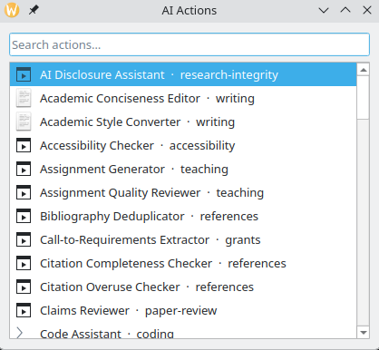

# AI action catalog

The AI action catalog of "micro-services" is a collection of narrow, single-purpose AI completion tasks, where
each task is a small, well-defined transformation like classifying text, extracting fields, or rewriting tone,
and designed to run against a small language model on local hardware rather than a large cloud-hosted foundation
model, using commands like,

```bash
cat manuscript.md | ai-actions run proofread --stdin --no-gui | tee proofread.md
```

or by copying text to the clipboard and using keyboard short cut to active actions, either directly or
using the **action picker** which opens a selection window to choose actions from.



The picker is a just-in-time
action selector for the busy user. No need to memorize the catalog, just select and choose.

The setup become:

- **one prompt** — a plain-text system prompt, version-controlled in a
  `services/*.yaml` file, alongside its input/output shape and how its
  result should be reviewed;
- **one model** — chosen per service in `models.yaml`, and swappable
  without touching the prompt;
- **no state** — a service doesn't remember you between runs and doesn't
  need an account, because it's a function call, not a chat.

An action is closer to a Unix filter than a copilot, and is more structured than a chat
session and less agentic than a coding session, more like a prompt library or a skill set.
The actions are here collected in a library to make simple daily AI tasks easy accessible and
useful in a practical way.

Every one of the [61 services in the catalog](services/index.md) runs like this, whether text resides
the clipboard or in a file, or it is triggered by a shortcut or by a pipe. Text in, text out,
reviewable at every step, see [Pipelines](guide/pipelines.md) for the full story.

## Motivation

The general foundation models from the AI giants are exceedingly powerful but come at significant
enterprise costs and perhaps more importantly with hefty privacy trade-offs that represent both
unnecessary overhead and great risks for simple tasks.

Despite the fact that some highly trained AI will soon be able to refactor the proof of Fermat's theorem,
solve a Clay Millennium prize problem, or carry out Nobel/ laureate level science research, it does not change
the reality that most of what many users want from AI is often mundane. Fix the grammar in this
abstract. Translate the select text. Tell me whether this reference exists. Find the command from
the manual. Turn these slides into a study guide. Check that the numbers in Table 3 match the ones
in the text. Explain this regulation in plain language.

Today, nobody needs a trillion-parameter model in a hyperscale data center for much of this. What is
needed is a model that is good enough, running on the machine already in front of you, and by narrowing
the scope down to individual actions, a much smaller model, that fits on a laptop and runs with no network
dependency, can perform these tasks well, cheaply, and privately, while still leaving room to escalate
to a larger model when a task genuinely needs broader reasoning.

Instead of exposing one general-purpose model and hoping it interprets an open-ended request correctly,
each "action" is its own tightly scoped prompt with a fixed input and output shape, e.g.,

```
prompt:
  system: |
    You are a professional translator.
    Translate the input text into Danish.
    Preserve formatting, tone and meaning.
    Output only the translation, nothing else.
```

This trades the flexibility of a general model for something a small local model can actually deliver
reliably: fast, private, offline-capable, and testable AI behavior for the everyday tasks that do not
need deep reasoning, only consistent, predictable transformation.

It is a fact that most users already own quite capable hardware. A laptop bought in the last
two or three years, a desktop with a mid-range GPU, a phone with a decent neural engine — these
run open-weight models in the 4–14 billion parameter range at usable speed, with the model weights
quantised to fit in a few gigabytes of memory. And the open models available at that size are,
for the mundane tasks above, good enough. Not "good enough for a demo". Good enough that the
difference from the frontier model is invisible in the output.


**ai-actions** is what that looks like as a tool instead of an argument.
It's a personal, YAML-driven engine for running small, single-purpose AI
actions against an OpenAI-compatible endpoint — local by default — wired
to a KDE global shortcut, a searchable picker, or the command line.

## Why this shape keeps paying off

- **Cheap to build.** The prompt *is* the service; the engine is generic.
  Adding a capability means adding a YAML file — see
  [Creating services](guide/creating-services.md).
- **Cheap to evaluate.** A single-purpose prompt has a single-purpose test:
  does *this* transform hold up on a handful of real examples? Nobody has
  to evaluate "the assistant."
- **Cheap to trust.** Every prompt in [the catalog](services/index.md) is a
  file you can read in ten seconds. Nothing leaves the machine unless a
  service's model profile says otherwise.
- **Cheap to replace.** A better model for a task is a one-line edit to
  `models.yaml` — see [Model profiles](guide/models.md).

It also matches what the underlying [service catalog](catalog.md) actually
looks like once you total it up: most of it is **checking**, not
generating — structure, methodology, statistics, citations, terminology,
numbers that should but don't match — and checking is exactly the task
class where a small local model is strongest and a wrong answer costs
almost nothing to catch. See [Design principles](philosophy.md) for the
architecture pattern (LLM + retrieval + deterministic validation) behind
that, and why the mundane, verifiable tasks were built first on purpose.

## Get started

The current repo assumes you that you have access to sufficiently capable LLM models
(defined in models.yaml) available at specific url end points with or without authentication,
most likely more of varying strength and certainly always a free local one. If you do
not then spend a minute to roll your own with LM studio, an ollama container or a llamacpp
podman quadlet, e.g. adding a _llamacpp.container_ file with the content,

```
[Unit]
Description=llama.cpp server
After=network-online.target
Wants=network-online.target

[Container]
Image=ghcr.io/ggml-org/llama.cpp:server-cuda
AddDevice=nvidia.com/gpu=all
PublishPort=8080:8080
Volume=%h/.models/huggingface:/models:ro,z
Exec=-m /models/Qwen3.8-27B-UD-Q4_K_M.gguf <options> --host 0.0.0.0 --port 8080
HealthCmd=curl -fsS http://localhost:8080/health || exit 1
HealthStartPeriod=300s
HealthInterval=30s

[Service]
Restart=10
TimeoutStartSec=600

[Install]
WantedBy=default.target
```

to the ~/.config/containers/systemd directory.

If your reaction to "local model" is "I don't have the hardware for that" — you probably do.

## Installation

Clone the ai-actions repo, cd into it, and then

```bash
# setup the virtual environment

uv venv
uv sync
uv pip install -r requirements.txt
uv pip install -e .
. .venv/bin/activate

# call to action

ai-actions list
ai-actions run proofread          # clipboard -> service -> review -> clipboard
ai-actions picker                 # search/pick a service interactively
```

See [Install](install.md) for the KDE shortcut, and [Examples](examples.md)
for worked walkthroughs beyond the clipboard case — pipelines, scripted
review-free runs, and building a new service end to end.

## Where to go next

- [Do you need the cloud?](local-models.md) — why a small local model is enough, and whether your hardware can run one.
- [Install](install.md) — getting `ai-actions` on your PATH and wired to a KDE shortcut.
- [Examples](examples.md) — concrete walkthroughs: pipelines, batch runs, building a service.
- [CLI reference](guide/cli.md) — `run`, `picker`, `list`, `service ...`.
- [Service manifest](guide/service-manifest.md) — the YAML schema behind every service.
- [Creating services](guide/creating-services.md) — `service create`/`edit`/`set`/`duplicate`.
- [Pipelines](guide/pipelines.md) — composing services into shell pipelines.
- [Model profiles](guide/models.md) — `models.yaml` and how services reference it.
- [Service catalog](services/index.md) — every service currently defined, browsable.
- [Full catalog](catalog.md) — the 145-entry backlog this was built from, and what's still open.
- [Design principles](philosophy.md) — the architecture pattern and priorities behind the catalog.
- [Architecture](architecture.md) — how the engine is put together.
- [Roadmap](roadmap.md) — project history and what's next.
